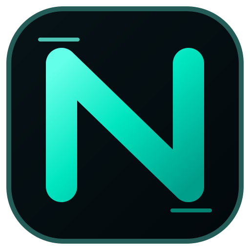

<div align="center">
  
  <br />
  
  <p><strong>Write simply. Create freely.</strong></p>
  <p>A small, readable programming language implemented in Rust.</p>
  <p>
    <a href="README.ja.md">日本語</a> ·
    <a href="docs/LANGUAGE.md">Language guide</a> ·
    <a href="docs/PACKAGES.md">Packages</a> ·
    <a href="docs/BRAND.md">Brand kit</a>
  </p>
</div>

Nilo ships as a single `nilo` command with an interpreter, persistent REPL, module system, runtime-checked type annotations, project manifests, tests, and developer inspection tools.

> **Status:** Nilo 0.2 is an alpha language. The syntax and standard library are usable for experiments and small tools, but compatibility may change before 1.0.

## Install

A local Rust toolchain is required while prebuilt releases are being established:

```bash
cargo install --git https://github.com/nullx2-x/nilo-lang
nilo --version
```

To build this checkout:

```bash
cargo build --release
./target/release/nilo examples/main.nilo
```

## Quick start

```bash
# Run a file directly.
nilo examples/main.nilo

# Run the entry declared in Nilo.toml.
nilo run

# Evaluate one expression or statement.
nilo -e 'print("Hello from Nilo")'

# Start the persistent REPL.
nilo

# Validate and test a project.
nilo check examples/main.nilo
nilo test

# Create a new project.
nilo init my-app
cd my-app
nilo run
```

## Language example

```nilo
from "math_tools" import add;
import "std/json" as json;

type Point {
    x: int;
    y: int;
}

func magnitude_squared(point: Point) -> int {
    return point.x * point.x + point.y * point.y;
}

let point: Point = Point(3, 4);
let values: list<int> = [1, 2, 3];
push(values, add(point.x, point.y));

print(json.stringify({
    "point": point,
    "score": magnitude_squared(point),
    "values": values
}, true));
```

## Features

- `let`, functions, recursion, records, and closures
- integers, floats, booleans, strings, lists, maps, and `nil`
- `if` / `else if` / `else`, `while`, `for ... in`, `break`, and `continue`
- runtime-checked type annotations such as `int`, `User?`, `list<str>`, and `map<str, any>`
- mutable variables, record fields, list indexes, and map indexes
- file modules using `export`, `import`, and `from ... import ...`
- standard modules: `std/json`, `std/regex`, `std/fs`, `std/http`, `std/time`, `std/list`, `std/string`, and `std/math`
- source-aware diagnostics with line and column excerpts
- CLI runner, persistent REPL, project initializer, test runner, token dump, and AST dump

## Meet Niro

<table>
  <tr>
    <td width="62%" valign="middle">
      <h3>Niro, the official Nilo mascot</h3>
      <p>Niro is a curious black cat who explores code, discovers ideas, and has a talent for finding bugs. The glowing forehead <strong>N</strong>, emerald eyes, paws, and tail tip connect Niro directly to the Nilo visual identity.</p>
      <p>Niro appears in documentation, tutorials, community artwork, and release communication while keeping the language friendly and approachable.</p>
      <p><a href="docs/prompts/niro-mascot.md">Mascot generation prompt</a> · <a href="docs/BRAND.md">Brand guidelines</a></p>
      <blockquote><strong>Write simply. Create freely.</strong></blockquote>
    </td>
    <td width="38%" align="center" valign="middle">
      
    </td>
  </tr>
</table>

## Command line

```text
nilo                         Start the interactive REPL
nilo <file.nilo>             Run a source file
nilo run [file.nilo]         Run a source file or Nilo.toml entry
nilo eval <source>           Evaluate source text
nilo -e <source>             Evaluate source text
nilo check <file.nilo>       Validate syntax without executing
nilo test [path]             Run every *_test.nilo file
nilo init [path] [--name N]  Create a new Nilo project
nilo tokens <file.nilo>      Print lexer tokens as JSON
nilo ast <file.nilo>         Print the AST as JSON
```

## Project layout

A Nilo package is a regular directory with `Nilo.toml`:

```toml
[package]
name = "my-app"
version = "0.1.0"
entry = "src/main.nilo"

[exports]
main = "src/main.nilo"
```

```text
my-app/
├── Nilo.toml
├── src/
│   └── main.nilo
└── tests/
    └── main_test.nilo
```

See [docs/LANGUAGE.md](docs/LANGUAGE.md) for the language guide and [docs/PACKAGES.md](docs/PACKAGES.md) for package conventions.

## Development

```bash
cargo fmt --all -- --check
cargo clippy --all-targets --all-features -- -D warnings
cargo test --all-targets
cargo run -- examples/main.nilo
cargo run -- test tests
```

The implementation is intentionally split into lexer, parser, AST, values, environment, interpreter, standard library, and CLI modules so the language can grow toward bytecode or native compilation without replacing its front end.

## Brand assets

The official wordmark, square icon, mascot artwork, palette, and generation prompt are maintained in the repository:

- [Nilo wordmark](docs/assets/nilo-logo.svg)
- [Nilo icon](docs/assets/nilo-icon.svg)
- [Niro mascot](docs/assets/niro-mascot.svg)
- [Brand guide](docs/BRAND.md)
- [Niro generation prompt](docs/prompts/niro-mascot.md)

## License

MIT
